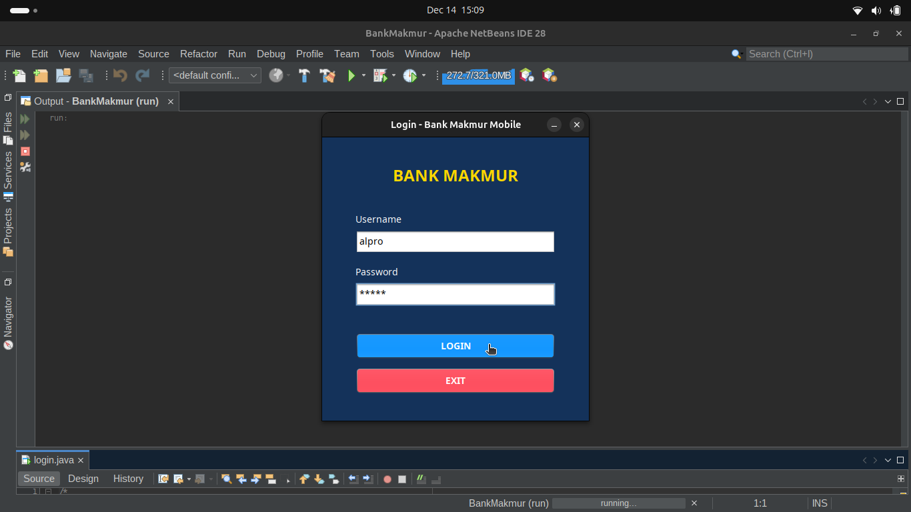
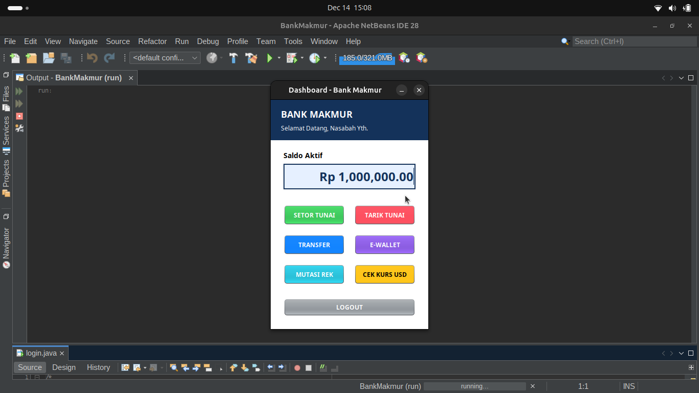

# Bank Makmur Mobile (BMM) 🏦

  <a href="#english-description">🇺🇸 English</a> | <a href="#deskripsi-indonesia">🇮🇩 Indonesia</a>

---

## 🇺🇸 English Description

**Bank Makmur Mobile** is a Desktop GUI Application built with **Java Swing**. It simulates a modern mobile banking experience with a clean, flat-design user interface.

This project demonstrates the implementation of Object-Oriented Programming (OOP) in Java, utilizing `JFrame` forms, event handling, and logical data manipulation (ArrayList) for transaction history.

### ✨ Key Features

1.  **🔐 Secure Authentication:** Login system with credential validation.
2.  **💳 Dashboard & Balance:** Real-time balance updates formatted in IDR (Rupiah).
3.  **💸 Standard Transactions:**
    * **Deposit (Setor Tunai):** Add funds to your account.
    * **Withdraw (Tarik Tunai):** Withdraw funds with balance validation.
    * **Transfer:** Send money to other account numbers.
4.  **📱 Digital Features (New):**
    * **E-Wallet Top-Up:** Support for GoPay, Dana, OVO, and ShopeePay.
    * **Currency Converter:** Check estimated balance in USD (US Dollar).
5.  **📜 Mutation History:** View a list of all session transactions stored in memory.

### 🔑 Default Login Credentials
To access the application, use the following account:
> **Username:** `alpro`
>
> **Password:** `alpro`

### 🚀 How to Run (NetBeans)

1.  Clone this repository.
2.  Open **NetBeans IDE**.
3.  Go to **File > Open Project** and select the folder.
4.  Find `login.java` inside the Source Packages.
5.  Right-click and select **Run File** (Shift+F6).

---

## 🇮🇩 Deskripsi Indonesia

**Bank Makmur Mobile** adalah aplikasi Desktop GUI yang dibangun menggunakan **Java Swing**. Aplikasi ini mensimulasikan pengalaman mobile banking modern dengan antarmuka yang bersih dan user-friendly.

Project ini mendemonstrasikan penerapan Pemrograman Berorientasi Objek (PBO/OOP) di Java, penggunaan `JFrame`, penanganan event (Action Listeners), dan manipulasi data logika (ArrayList) untuk riwayat transaksi.

### ✨ Fitur Utama

1.  **🔐 Sistem Login:** Validasi keamanan username dan password.
2.  **💳 Dashboard Saldo:** Tampilan saldo realtime dengan format Rupiah (Rp).
3.  **💸 Transaksi Standar:**
    * **Setor Tunai:** Menambah saldo rekening.
    * **Tarik Tunai:** Penarikan uang dengan validasi saldo.
    * **Transfer:** Kirim uang ke nomor rekening lain.
4.  **📱 Fitur Digital (Baru):**
    * **Top-Up E-Wallet:** Mendukung GoPay, Dana, OVO, dan ShopeePay.
    * **Cek Kurs:** Konversi estimasi saldo ke mata uang USD.
5.  **📜 Mutasi Rekening:** Melihat riwayat transaksi (Log aktivitas) selama sesi berjalan.

### 🔑 Akun Login (Default)
Gunakan akun berikut untuk masuk ke dalam aplikasi:
> **Username:** `alpro`
>
> **Password:** `alpro`

### 🚀 Cara Menjalankan

1.  Clone atau Download repository ini.
2.  Buka **NetBeans IDE**.
3.  Pilih **File > Open Project** dan cari folder project ini.
4.  Cari file `login.java` di dalam Source Packages.
5.  Klik Kanan -> **Run File** (atau tekan Shift+F6).

---

## 📸 Screenshots

  <b>Login Interface</b> 
  

  <b>Main Dashboard</b> 
  

---

  Created with ❤️ by <b>BAY</b>

